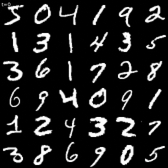
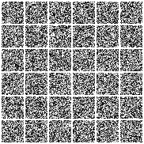

# MNIST Diffusion


Only simple depthwise convolutions, shorcuts and naive timestep embedding, there you have it! A fully functional denosing diffusion probabilistic model while keeps ultra light weight **4.55MB** (the checkpoint has 9.1MB but with ema model double the size).

## Training
Install packages
```bash
pip install -r requirements.txt
```
Start default setting training 
```bash
python train_mnist.py
```
Feel free to tuning training parameters, type `python train_mnist.py -h` to get help message of arguments.

## 条件生成与 Classifier-Free Guidance (CFG)

可选地使用**数字类别标签**进行条件生成，并支持 **Classifier-Free Guidance**，从而按指令生成指定数字。

- **条件训练**：加上 `--conditional`，模型会同时接收图像与标签（0–9）；训练时以一定概率将标签替换为“空”类（class dropout），以便推理时做 CFG。
- **指定数字采样**：`--labels 3` 表示整批都生成数字 3；`--labels 0,1,2,3,4,5,...` 可逐样本指定标签（个数须等于 `--n_samples`）。
- **CFG 强度**：`--cfg_scale 2.0`（或 2.0–3.0）可增强“符合条件”的效果；为 0 则不使用 CFG。

示例：

```bash
# 条件训练（约 40 个 epoch）
python train_mnist.py --conditional --epochs 40 --class_dropout_prob 0.1

# 从已有条件 checkpoint 继续训练，并每轮采样“全是 7”的 36 张图，CFG=2.0
python train_mnist.py --conditional --ckpt results/xxx/steps_xxxxxx.pt --labels 7 --cfg_scale 2.0 --n_samples 36
```

加载条件模型 checkpoint 时务必同时加上 `--conditional`，否则结构不匹配。

## Reference
A neat blog explains how diffusion model works(must read!): https://lilianweng.github.io/posts/2021-07-11-diffusion-models/

The Denoising Diffusion Probabilistic Models paper: https://arxiv.org/pdf/2006.11239.pdf 

A pytorch version of DDPM: https://github.com/lucidrains/denoising-diffusion-pytorch

## Playing
- [x] [理解 Stable Diffusion UNet 网络 « bang's blog](https://blog.cnbang.net/tech/3823/)
- [x] test 的时候使用使用同样的初始噪声
- [x] 可视化加噪过程  
    
- [x] 保存训练相关的参数到 result 文件夹
- [ ] 比较不同的网络尺寸
- [x] 条件生成 (Extra): 加入类别标签（Digit Label），实现 Classifier-Free Guidance (CFG)，可按指令生成指定数字（见上文「条件生成与 CFG」）  
    
- [ ] U-Net 怎么加 attention？

